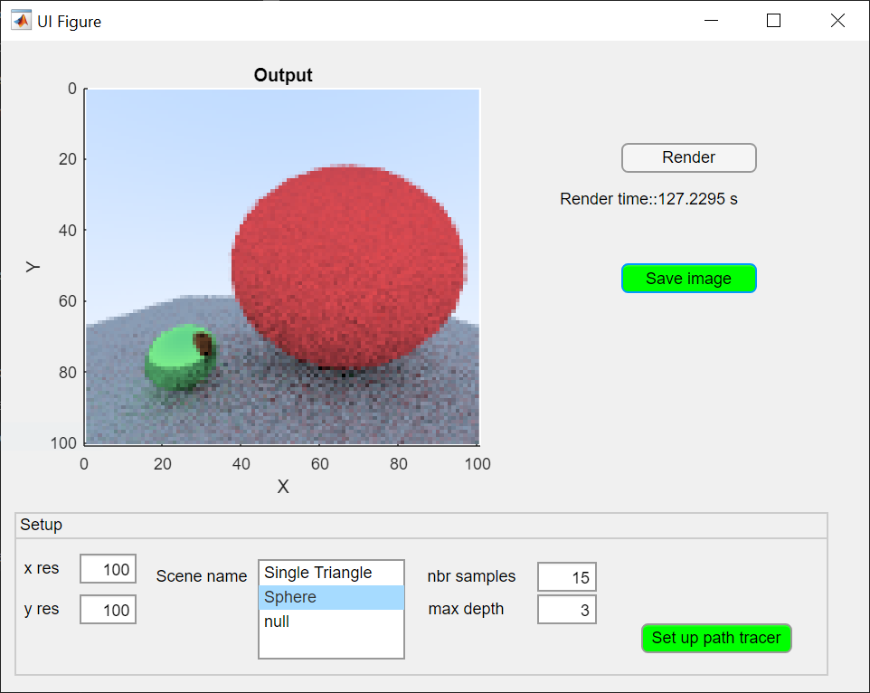

# Path tracer in MATLAB

A CPU path tracer in MATLAB

## Current implemented features (in order of implementation)
- basic GUI
- vectorised ray-triangle intersection
- antialiasing
- generate triangulated sphere
- multiple diffuse bounces
- gamma correction
- programmable scattering functions
- reflective materials

  

